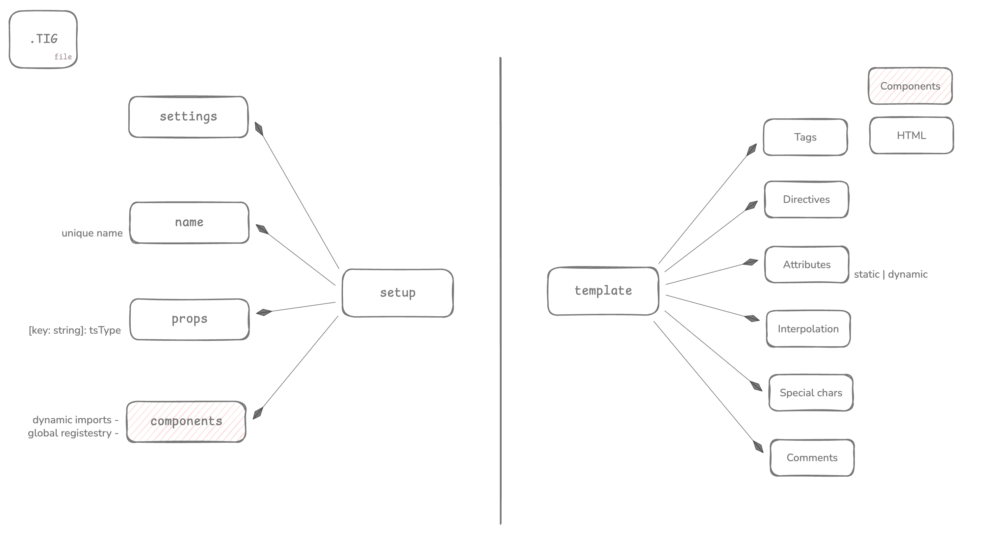
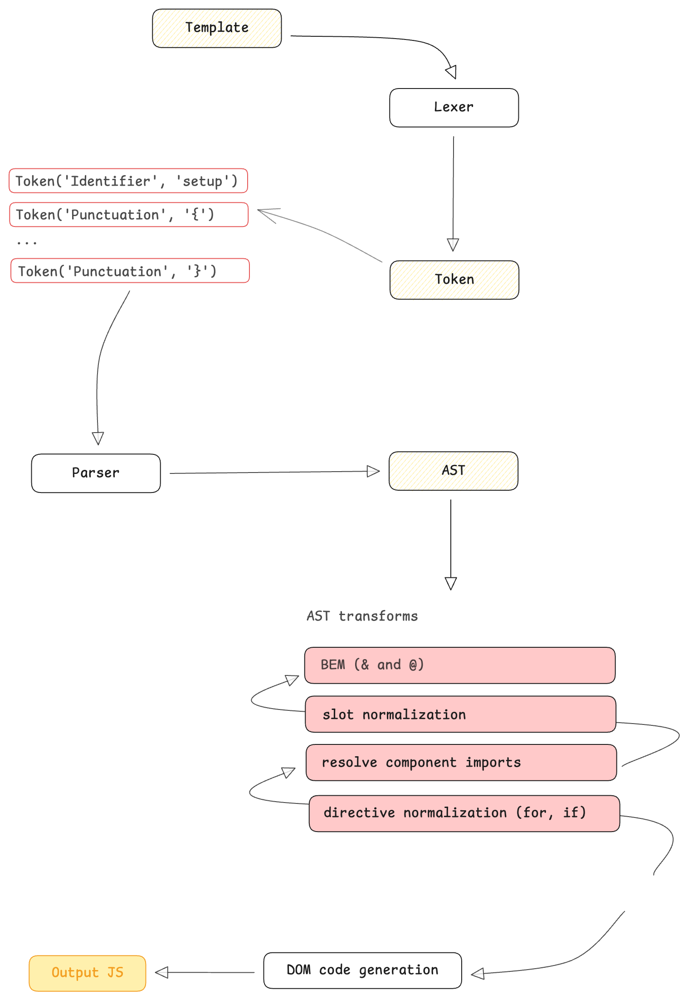

# Шаблонизатор с компилятором

1. Цель: компонентный шаблонный язык с типизированными пропсами;
Синтаксис вдохновлён Vue/HTML с собственными расширениями;
Компиляция в DOM-операции и статический HTML


*Структура документа:*
- Блоки файла
- Формальное определение синтаксиса
- Токены (лексический уровень)
- AST
- Жизненный цикл компилятора
- Парсерные комбинаторы (компилятор)


## 2. Структура файла
Файл `.tig` состоит из двух блоков: SetupBlock + TemplateBlock

`setup {}` - настраивает компонент: описывает имя, импортируемые компоненты и ect;

`template {}` - композиция HTML-тегов, компонентов, директив




## 3. Формальное определение синтаксиса

Пример шаблона в [example](example.tig "Открыть пример")

```yaml
SetupBlock:
  setup { SetupProperty* }

SetupProperty:
  name: StringLiteral;
  settings: ComponentSettings;
  props: PropsDefinition;
  components: ComponentImport[];

TemplateBlock:
  template { Node* }

Node:
  Element | Component | Slot | Text | Interpolation | TemplateFragment
```


## 4. Токены (лексический уровень)

| TokenType          | Примеры                      | Комментарий   |
| ------------------ | ---------------------------- | ------------- |
| Identifier         | `setup`, `template`, `div`   | Базовое слово |
| StringLiteral      | `"abc"`, `'xyz'`             |               |
| NumberLiteral      | `123`                        |               |
| Punctuation        | `{`, `}`, `<`, `>`, `/`, `:` |               |
| InterpolationStart | `{{`                         |               |
| InterpolationEnd   | `}}`                         |               |
| CommentLine        | `// ...`                     |               |
| CommentBlock       | `/* ... */`                  |               |
| Text               | любой текст                  |               |


## 5. AST (структурный уровень)

// Показать пример дерева.
Примерные части АСТ:
- ProgramNode
- SetupBlockNode
- TemplateBlockNode
- ElementNode
- ComponentNode
- SlotNode
- TemplateFragmentNode
- AttributeNode
- IfDirectiveNode
- ForDirectiveNode
- InterpolationNode
- TextNode

## 6. Жизненный цикл компилятора


```md
.tig file
   ↓
Lexer → Token[]
   ↓
Parser → AST
   ↓
AST transforms:
    - BEM (& and @)
    - resolve component imports
    - slot normalization
    - directive normalization (for, if)
   ↓
Codegen:
    - DOM code generation
   ↓
Output JS
```

## 7. Парсерные комбинаторы

Реализация парсера.
Подаваемый текст на вход парсится в дерево AST. И для представленного шаблона придумана
иерархия парсерных комбинаторов.

- поддержка строчного парсинга
- поддержка потоковой передачи кусков шаблона на парсинг:
```ts
const div = tag('<div>')
div('<di').next('v>') // {value: Token, done: true}
```


Комбинаторы:
- seq(...)
- or(...)
- tag(...)
- take(regex, count?)
- many(...)


## 8. Преобразования (transforms)

BEM transform

- &__item → принимает текущий блок контекста
- @__item → принимает блок родителя, куда вставляется слот
    (слот определяется через атрибут имени)


## 9. Вдохновение
За годы работы с vue SFC и tsx шаблонами, мне особенно приглянулись синтаксические возможности.
Я забрал к себе все, что мне могло помочь в работе.

И, конечно же, не мог обойти стороной имплементацию элементов БЭМ методологии. Поскольку в первую
очередь этот шаблонизатор был призван мне помочь удобно верстать компоненты системы;


## 10. Tradeoffs

Можно было бы натравить парсерные комбинаторы на весь шаблон, поделив его на wordLike символы.
Но из-за наличия строчных комментариев, шаблон будем парсить построчно

В связи с этим формируется требование о возможности парсинга в виде потоков с приостановлением программы.


---

В этом документе описаны:
- Архитектура компилятора
- Элементы шаблона
- Жизненный цикл компилятора
- Преобразования / возможности шаблонизатора


### Возможности шаблонизатора:
- Поддержка БЭМ синтаксиса

Компоненты:
- Динамическая загрузка
- Регистрация к глобальной области видимости

- Транслация в HTML


Задачи:
- реализовать лексический парсер
Это процесс преобразования последовательности входных данных в 
последовательность токенов

- Посмтроить АСТ

- Реализовать различные функции для работы с АСТ или токенами

- Сериализация - преобразование АСТ или токенов 


На примере этого шаблона разберем, как устроен парсер


Для этого определяется набор парсеров, которые 


---
Детали реализации
В Js есть возможность делать сегментацию текста по предложениям, словам и символам
с помощью Intl.Segmenter;

Можно было бы натравить парсерные комбинаторы на весь шаблон, поделив его на wordLike символы.
Но из-за наличия строчных комментариев, шаблон будем парсить построчно

В связи с этим формируется требование возможности парсинга в виде потоков с приостановлением программы.

Значит:
- Представленный текст будет обработан в кодировке UTF-8 построчно
- Парсинг тэгов должен работать поточно

Распарсив какой-то фрагмент, будет переключение состояний - конечный автомат с магазинной очередью.
Например, после setup ожидается 3 состояния: name, components, props;

Поскольку парсер реализуется Js на платформе nodeJs (V8 движок), существуют скрытые классы.
Поэтому следует писать код шаблона в единой структурной последовательности


--
Переходы состояний:
Есть контракт, что шаблон может начинаться с setup.
Дальше он переходит не более чем в 4 состония - это его параметры.
Дальше для каждого из параметров при парсинге определяются Токены и строится AST;


---

Почему это работает и как это работает?

Парсеру на вход мы передаем строку. У строки есть итератор. Это означает, что мы можем обойти посимвольно
какую-то часть строки и запомнить то место, на котором мы остановились.

`setup { ... }` - этот шаблон, представленный строкой, можно разбить на несколько этапов:
1. Итерацию строки с начала мы определили слово "setup". Это этап парсинга настроек компонента.
2. Продолжаем парсить с места, где мы остановились. Дальше идет '{' - символ знаменующий тело настроек
3. Продолжаем с символа начала тела и парсим само тело: ... - настройки
4. Как только встретим '}' - означает конец определения настроек компонента

Итого:
За одну итерацию, имея ключевые слова системы, парсер строит АСТ дерево, определяя сущности компонента

Определим набор парсерных комбинаторов, которые могут распарсить эту строку: `setup { ... }`


1. tag - с начала итерируемой строки сапоставляет паттерн и символы строки
2. opt - определяет опциональность символов переданного итератора по паттерну
3. seq - определяет последовательность переданных парсеров

